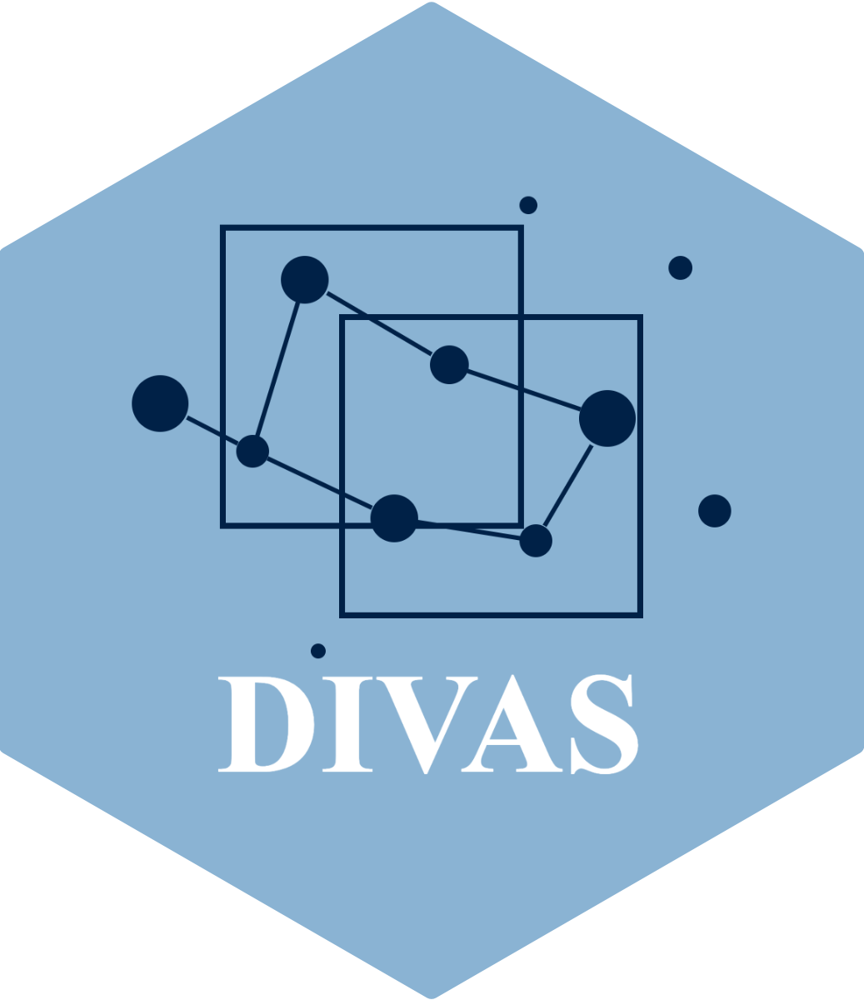

# DIVAS: Data Integration via Analysis of Subspaces

<p align="center">

</p>

## Introduction

We provide R implementation of DIVAS (Prothero et al., 2024),a statistical method for multi-modal data integration. 
Via statistical analysis of subspaces, DIVAS identifies joint, partially shared and individual variations of multiple data blocks in a completely
data driven way. In addition to providing an R implementation based on the original MATLAB implementation, we also designed visualisation tools for exploring DIVAS results.


## Installation

### Dependencies

The DIVAS package requires the `CVXR` package to be able to use optimisation solvers like SCS. 
We strongly recommend installing the latest stable version from CRAN.

```R
# Install devtools (if not already installed)
install.packages("devtools")

# Install the latest version of CVXR from CRAN
# This is critical to avoid issues with solver status recognition (e.g., for SCS)
install.packages("CVXR")
```

### Installing the DIVAS package

You can install the development version of DIVAS from GitHub using `devtools`:

```R
# Install DIVAS package from the main branch on GitHub
devtools::install_github("ByronSyun/DIVAS_Develop/pkg", ref = "main")

# Or install from a local folder if you have cloned the repository
# devtools::install("path/to/DIVAS-main/pkg")
```

## Real data examples

We provide the following examples to illustrate the use of DIVAS in different scenarios.

| Dataset             | Brief Description                                  | Vignette Link                                                                                              | Format | Primary Reference      |
|---------------------|----------------------------------------------------|------------------------------------------------------------------------------------------------------------|--------|------------------------|
| toyDataThreeWay.mat | Synthetic 3-block data with known joint structures | [Toy Dataset Example](https://byronsyun.github.io/DIVAS_Develop/articles/DIVAS_Toy_Dataset_Example.html)       | .mat   | Prothero et al. (2024) |
| gnp_imputed.qs      | GNP economic time series data                      | [GNP Dataset Example](https://byronsyun.github.io/DIVAS_Develop/articles/DIVAS_GNP_Dataset_Example.html) | .qs    | Stock & Watson (2016)  |
| COVID-19 Multi-Omics | 6-block integration: scRNA-seq (4 cell types), proteomics, metabolomics from 114 COVID-19 patient samples | [COVID Case Study](https://byronsyun.github.io/DIVAS_COVID19_CaseStudy/)                                                                                                | .rds    | Su et al. (2020)       |


## Developers

* **[Jiadong Mao](https://github.com/jiadongm)** - *Lead Developer, Maintainer*
* **[Yinuo Sun](https://github.com/ByronSyun)** - *Package Developer, Maintainer*

## References

Prothero, J., et al. (2024). Data integration via analysis of subspaces (DIVAS). TEST.

## License

This project is licensed under the GNU Affero General Public License v3.0 (AGPL-3) - see the LICENSE file for details.

